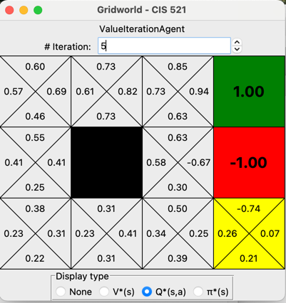
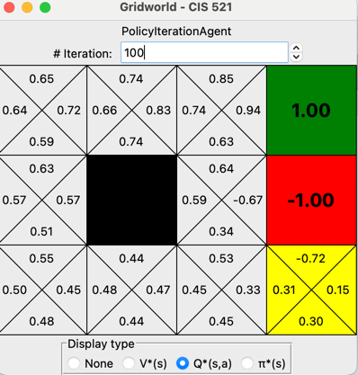
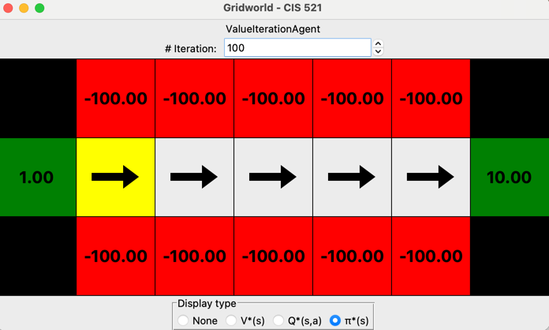
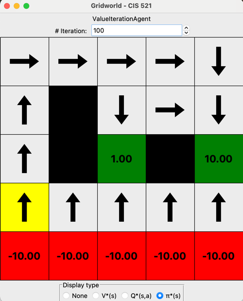

# Markov Process Agents Implementation

Implementation of various markov process agents for solving a world with reward and cliff

## Features
Expectimax, Markov process

## Implemented Agents

### Markov Agent
The `ValueIterationAgent` class implements the classic expectimax single iteration markov decision algorithm:
- Maintains a value function mapping states to their expected utilities
- Computes q(expecation) for state-action pairs
- Extracts optimal policies based on maximizing expectation



*Agent in 5th iteration of current method*

### Markov Agent Improve
The `PolicyIterationAgent` class improve converge speed and iteration efficiency:
- Alternates between policy evaluation and policy improvement
- When assigning new value to each state, fix the action to reduce complexity



*Agent in improved iteration method*
## Parameter Analysis (part 2)

The implementation provides solutions for analyzing how discount, noise, and living reward parameters affect agent behavior:

1. **Bridge Crossing Analysis**: Determines parameters that encourage/discourage crossing a risky bridge



*Agent choose far side high reward risking cliff*

2. **Policy Analysis**: Finds parameter combinations that produce specific behaviors:
  - Preferring closer exits with/without risk
  - Preferring distant exits with/without risk
  - Avoiding termination altogether



*Policy Analysis: Example of walking far but choose near end position*

## Running the Code

```
# Run with default MDP iteration
python gridworld.py

# Run with improved version iteration
python3 gridworld.py -a policy

# Run with custom parameters
python3 gridworld.py --discount 0.9 --noise 0.2 bridge

# Run with specific grid and iterations
python3 gridworld.py --discount x --noise x --living-reward x discount
